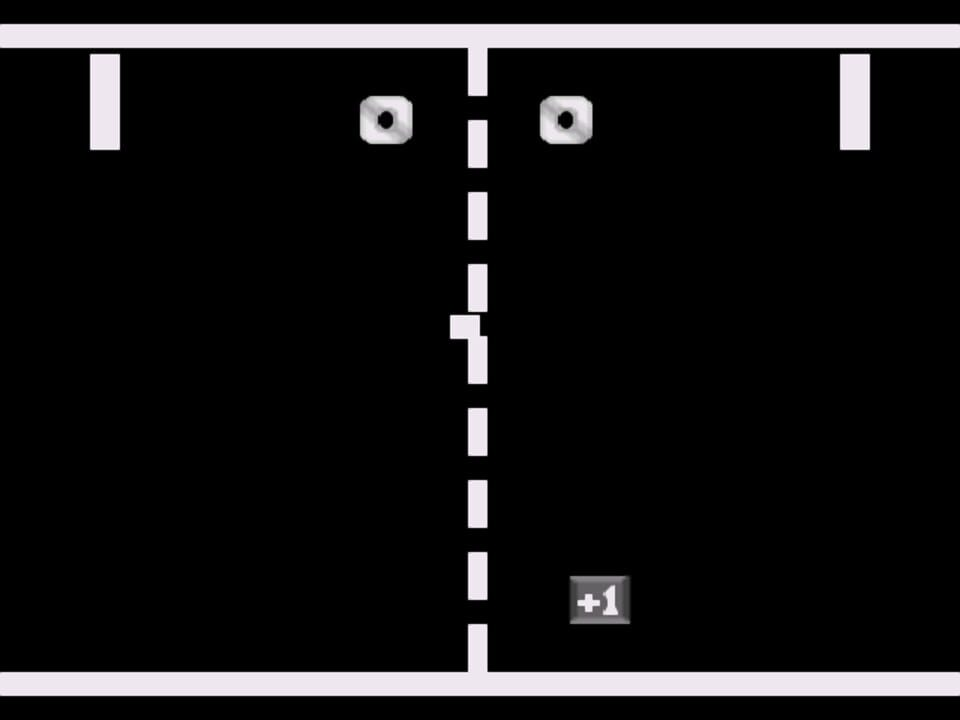

# Общая концепция:

Это аркадная игра, в которой два игрока соревнуются, отбивая мячик при помощи "ракеток". Цель игры - набрать 10 очков первым.

# Основные элементы:

1. Игровое поле: Прямоугольная область, обычно черного цвета, служащая фоном для игры. По центру проходит тонкая белая линия, разделяющая поле на две части.
2. Ракетки (Paddle): Две вертикальные прямоугольные полосы, по одной на каждой стороне экрана. Игроки управляют своими ракетками, перемещая их вверх и вниз.
3. Мячик (Ball): Круглый объект, который перемещается по игровому полю, отскакивая от стенок и ракеток.
4. Счет: Отображается вверху экрана для каждого игрока.
5. Управление: Игроки управляют своими ракетками с помощью клавиш на клавиатуре.

# Игровой процесс:

1. Мячик начинает движение из центра экрана в случайном направлении.
2. Игроки перемещают свои ракетки вверх и вниз, чтобы отбить мячик.
3. Когда мячик отбивается ракеткой, он меняет направление и продолжает свое движение по полю.
4. Если мячик пролетает мимо ракетки и уходит за пределы экрана (слева или справа), игрок на противоположной стороне получает очко.
5. Мячик возвращается в центр поля после того, как был забит гол.
6. Скорость мячика постепенно увеличивается с каждым отскоком от ракетки, делая игру сложнее.
7. Игра продолжается, пока один из игроков не наберет 10 очков.
8. После достижения этого порога игра заканчивается, на экране появляется сообщение о победителе, и появляется возможность начать новую игру.

# Цель игры:

>Цель игры - набрать 10 очков первым, не позволяя мячику проскользнуть мимо ракетки.

# Особенности:
|Динамика:|Соревнование:|Простота:|
|-|-----|--------------|
|По мере игры, скорость мячика увеличивается, требуя от игроков более быстрой реакции.|Игра предлагает соревновательный опыт между двумя игроками или с компьютером (не реализовано в текущем коде).|Игра простая и интуитивно понятная, что делает ее доступной для игроков любого возраста и уровня подготовки.|

# В итоге:

Это динамичная и простая игра, которая проверяет реакцию и точность игроков. Игроки должны умело управлять своими ракетками, чтобы отбивать мячик и не дать сопернику забить гол.
